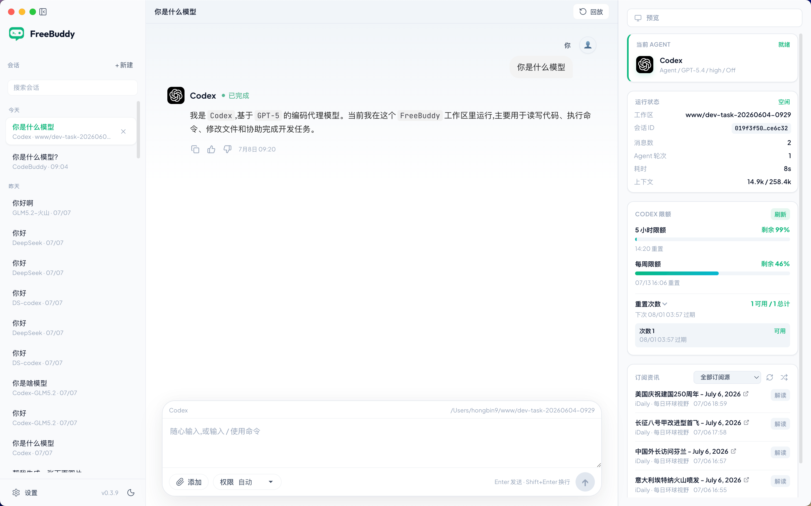
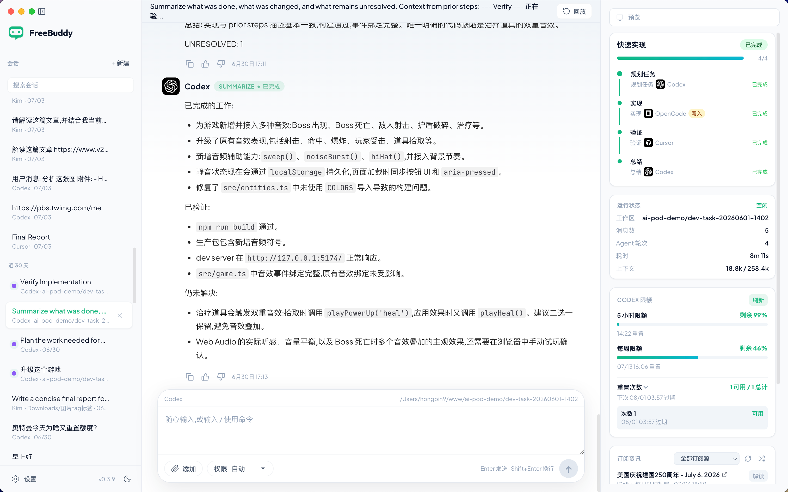

# FreeBuddy

<p align="center">
  <a href=""></a>
</p>

<p align="center">
  <a href="README.md">English</a> | <a href="README.zh-CN.md">简体中文</a>
</p>

**A desktop workbench for local coding agents.** ⚡

Use Codex, ClaudeCode, OpenCode, Cursor, Kimi, Qoder, and CodeBuddy side by side in one interface — each agent runs in its own workspace, with all tasks tracked in one place. Two modes are supported:
* **Normal Mode**


* **Team Execution Mode (Multi-Agent Collaboration)**


### [⬇️ Download FreeBuddy](https://github.com/maojindao55/freebuddy/releases/latest)

---

## Features

| Feature | Description | Demo |
|---------|-------------|------|
| **Multi-Agent Support** | Automatically detects locally installed agents |  |
| **BYOK Support** | Codex and ClaudeCode support BYOK — use third-party or proxy APIs |  |
| **Codex Usage Card** | Real-time view of Codex usage and rate limit reset times. Hot-switch accounts without re-login. |  |

### 🎬 Workflow Teams
Orchestrate multi-agent workflows with team templates. Run Codex for implementation, ClaudeCode for review, Kimi for testing — all in parallel.

https://github.com/user-attachments/assets/9665bf24-9150-4ffa-b571-10eece2d2062

### 📰 FeedRSS Card
Stay up to date with the latest news while waiting for agents to finish executing.

https://github.com/user-attachments/assets/380965e3-d4eb-4ad1-bb0d-ded33c5272e9

### 💥 Code Whip
Feeling frustrated? Give your agent a good whipping — speed it up and relieve some stress.

https://github.com/user-attachments/assets/8bab605f-6f1b-4e53-a520-c3f5a6645ace


---

## Built-In Agents

FreeBuddy is compatible with **all CLI-based AI coding tools** — if it runs in a terminal, it runs in FreeBuddy.

<p>
  <a href="https://www.npmjs.com/package/@agentclientprotocol/codex-acp"><kbd> Codex</kbd></a> &nbsp;
  <a href="https://www.npmjs.com/package/@agentclientprotocol/claude-agent-acp"><kbd> ClaudeCode</kbd></a> &nbsp;
  <a href="https://www.npmjs.com/package/opencode-ai"><kbd> OpenCode</kbd></a> &nbsp;
  <a href="https://cursor.com/install"><kbd> Cursor</kbd></a> &nbsp;
  <a href="https://code.kimi.com"><kbd> Kimi</kbd></a> &nbsp;
  <a href="https://qoder.com/install"><kbd> Qoder</kbd></a> &nbsp;
  <a href="https://www.npmjs.com/package/@tencent-ai/codebuddy-code"><kbd> CodeBuddy</kbd></a> &nbsp;
  <kbd>+ any CLI agent</kbd>
</p>

<details>
<summary>Installation Commands</summary>

| Agent | Command | Installation | Status |
|--------|---------|--------|--------|
| **Codex** | `codex-acp` | `npm install -g --force @agentclientprotocol/codex-acp` | ✅ |
| **ClaudeCode** | `claude-agent-acp` | `npm install -g @agentclientprotocol/claude-agent-acp` | ✅ |
| **OpenCode** | `opencode` | `npm install -g opencode-ai` | ✅ |
| **Cursor** | `cursor-agent` | `curl https://cursor.com/install -fsS \| bash` | ✅ |
| **Kimi** | `kimi` | `curl -fsSL https://code.kimi.com/kimi-code/install.sh \| bash` | ✅ |
| **Qoder** | `qodercli` | `curl -fsSL https://qoder.com/install \| bash` | ✅ |
| **CodeBuddy** | `codebuddy` | `npm install -g @tencent-ai/codebuddy-code` | 🆕 |

</details>

Open **Settings → Coding Agents** to:
- ✅ Check installed runtimes
- 📥 Run recommended install commands
- ⚙️ Customize binary paths, models, and extra arguments
- 🌐 Configure environment variables
- 🎨 Choose agent avatars

---

## Installation

### Desktop (macOS / Windows / Linux)

**Quick Download:** [FreeBuddy Releases](https://github.com/maojindao55/freebuddy/releases/latest)

| Platform | Download | Package Manager |
|----------|---------|----------------|
| **macOS (Apple Silicon)** | `.dmg` | `brew install --cask maojindao55/freebuddy/freebuddy` |
| **macOS (Intel)** | `.dmg` | - |
| **Windows** | `.exe` installer | - |
| **Ubuntu / Debian (x64)** | `.deb` | `sudo apt install ./FreeBuddy_Ubuntu_x64-<version>.deb` |
| **Linux (x64)** | `.AppImage` | `chmod +x FreeBuddy_Linux_x64-<version>.AppImage` |

The AppImage uses a static runtime and runs on current Ubuntu releases without installing FUSE 2.

### Build from Source

Prerequisites: Node.js 18+, npm 9+

```bash
# Clone the repository
git clone https://github.com/maojindao55/freebuddy.git
cd freebuddy

# Install dependencies
npm install

# Run in development mode
npm run dev

# Production build
npm run build
npm run start
```

Before pushing a branch or creating a pull request, verify both the stored
GitHub CLI login and real API access:

```bash
npm run github:preflight
```

The check never prints token values or creates a new OAuth token. If it fails,
follow the displayed recovery instructions and run the check again. Inside a
Codex sandbox, verify once with system permissions before starting a new login,
because the sandbox may be unable to access the macOS keychain or network.

> **Note:** `postinstall` runs `electron-rebuild` for `better-sqlite3` to ensure the native binding matches your Electron version.

---

## Star History

[](https://www.star-history.com/?repos=maojindao55%2Ffreebuddy&type=date&legend=top-left)

---

## Community & Support

- 🐧 **QQ Group:** [Click to join](https://qm.qq.com/q/Lgu4uyIWCC)

---

## Contributing

Contributions are welcome! Please read our [Contributing Guide](CONTRIBUTING.md) before getting started.

### Contributors

<a href="https://github.com/maojindao55/freebuddy/graphs/contributors">
  
</a>

---

## License

FreeBuddy is licensed under the [MIT License](LICENSE).

---

<p align="center">
  Made with ❤️ by <a href="https://github.com/maojindao55">maojindao55</a>
</p>
