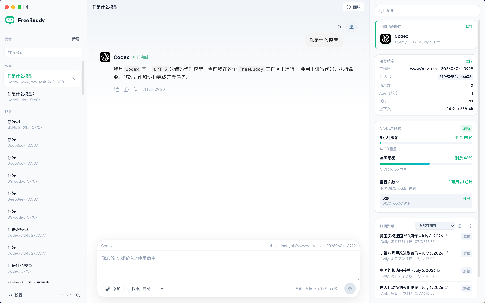
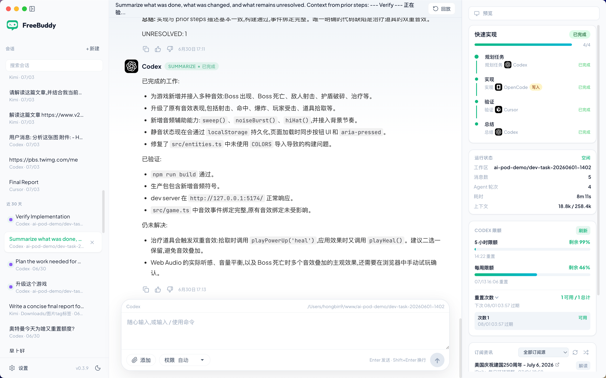

# FreeBuddy

<p align="center">
  
</p>

<p align="center">
  <a href="README.md">English</a> | <a href="README.zh-CN.md">简体中文</a>
</p>

**A desktop workbench for local coding agents: track tasks, hand off context, and coordinate teams.** ⚡

Use local coding tools such as Codex, ClaudeCode, and OpenCode in one interface. Choose an agent and project directory for each conversation, track tasks across projects, and organize different agents for implementation, review, and verification.

Two ways to work:

### Normal Mode

Start a task with one agent, monitor multiple conversations in the task panel, and hand off a conversation to another agent when needed.



### Team Execution Mode (Multi-Agent Collaboration)

Arrange steps with workflow templates, or let an entry agent delegate subtasks according to teammates' capabilities.



### [⬇️ Download FreeBuddy](https://github.com/maojindao55/freebuddy/releases/latest)

---

## Quick Start

1. [Download and install FreeBuddy](https://github.com/maojindao55/freebuddy/releases/latest). Open **Settings → CLI Agents**, check or install the agents you need, and sign in or configure an API key.
2. Create a conversation, select a local project directory and agent, and send your task in **Normal Mode**.
3. For implementation and review by different agents, switch to **Team Execution Mode** and select a team. Adjust roles, agents, and execution policies in **Settings → Workflow Teams**.

When several tasks are running, switch the conversation list to the **Task Panel** to filter by project, execution status, or unread conversations, and view it fullscreen.

To continue with another agent, wait for the current run to finish or stop it first. Open **Share or hand off this conversation** at the top of the conversation and choose **Hand off to an agent**. Preview the handoff brief, then let the selected agent continue in a new conversation.

---

## Features

| Feature | Description | Demo |
|---------|-------------|------|
| **Task Panel** | Monitor conversation status, recent activity, failures, and pending requests across projects; filter, search, and view fullscreen | — |
| **Cross-Agent Handoff** | Pass the task goal, recent instructions, response summary, and file changes to another agent as handoff context | — |
| **Team Orchestration** | Configure planning, implementation, review, and verification roles with workflow templates, review-and-fix loops, and autonomous delegation | — |
| **Multi-Agent Support** | Automatically detects installed local agents and adapters |  |
| **BYOK Support** | Configure your own API keys, endpoints, and models for Codex, ClaudeCode, DeepSeek Harness, and Pi |  |
| **Codex Usage Card** | View Codex usage and rate limit reset times, and switch between saved accounts |  |

### 🎬 Workflow Teams

- **Workflow teams:** Execute configured planning, implementation, review, and verification steps. Built-in delivery workflows can return to implementation based on review or verification feedback, with approval gates and loop limits.
- **Delegation teams:** An entry agent assigns subtasks to roles in its roster and continues after results return. Configure role write access, approval before delegated writes, delegation depth, and timeouts.

For example, use Codex for implementation, ClaudeCode for review, and another agent for verification. Dependent steps run in sequence; independent steps may run in parallel according to workflow configuration and runtime policy.

https://github.com/user-attachments/assets/9665bf24-9150-4ffa-b571-10eece2d2062

### 📰 FeedRSS Card

Browse subscribed news feeds while waiting for agents to finish.

https://github.com/user-attachments/assets/380965e3-d4eb-4ad1-bb0d-ded33c5272e9

### 💥 Code Whip

Click a running agent's avatar to play the Code Whip animation and unwind while you wait.

https://github.com/user-attachments/assets/8bab605f-6f1b-4e53-a520-c3f5a6645ace


---

## Supported Agents

FreeBuddy provides built-in integrations for the tools below, connecting to local agents through ACP (Agent Client Protocol) adapters. Some tools need a separate adapter installation; terminal support alone does not guarantee integration. Models, sign-in methods, and tool capabilities depend on the agent and adapter.

<p>
  <a href="https://www.npmjs.com/package/@agentclientprotocol/codex-acp"><kbd> Codex</kbd></a> &nbsp;
  <a href="https://www.npmjs.com/package/@agentclientprotocol/claude-agent-acp"><kbd> ClaudeCode</kbd></a> &nbsp;
  <a href="https://www.npmjs.com/package/opencode-ai"><kbd> OpenCode</kbd></a> &nbsp;
  <a href="https://cursor.com/install"><kbd> Cursor</kbd></a> &nbsp;
  <a href="https://code.kimi.com"><kbd> Kimi</kbd></a> &nbsp;
  <a href="https://qoder.com/install"><kbd> Qoder</kbd></a> &nbsp;
  <a href="https://www.npmjs.com/package/@tencent-ai/codebuddy-code"><kbd> CodeBuddy</kbd></a> &nbsp;
  <a href="https://github.com/deepseek-ai/deepseek-harness"><kbd> DeepSeek</kbd></a> &nbsp;
  <kbd>Grok</kbd> &nbsp;
  <kbd>Antigravity</kbd> &nbsp;
  <kbd>ZCode</kbd> &nbsp;
  <kbd>Cline</kbd> &nbsp;
  <kbd>Devin</kbd> &nbsp;
  <kbd>Pi</kbd>
</p>

<details>
<summary>Commands and Installation</summary>

Use **Settings → CLI Agents → Install** for the installation method appropriate to your platform. Shell commands below target macOS / Linux; Windows users should use the installation entry in Settings.

| Agent | Command | Installation |
|--------|---------|--------|
| **Codex** | `codex-acp` | `npm install -g --force @agentclientprotocol/codex-acp` |
| **ClaudeCode** | `claude-agent-acp` | `npm install -g --include=optional @agentclientprotocol/claude-agent-acp` |
| **OpenCode** | `opencode` | `npm install -g opencode-ai` |
| **Cursor** | `cursor-agent` | `curl https://cursor.com/install -fsS \| bash` |
| **Kimi** | `kimi` | `curl -fsSL https://code.kimi.com/kimi-code/install.sh \| bash` |
| **Qoder** | `qodercli` | `curl -fsSL https://qoder.com/install \| bash` |
| **CodeBuddy** | `codebuddy` | `npm install -g @tencent-ai/codebuddy-code` |
| **Grok** | `grok` | Settings → CLI Agents → **Install** |
| **Antigravity** | `agy-acp` | `npm install -g agy-acp-bridge`; requires an available Antigravity CLI |
| **DeepSeek Harness** | `deepseek-harness-acp` | Settings → CLI Agents → **Install** (`deepseek-harness-acp`) |
| **ZCode** | `zcode-acp-server` | `npm install -g zcode-acp-server` |
| **Cline** | `cline` | `npm install -g cline` |
| **Devin** | `devin` | Settings → CLI Agents → **Install** |
| **Pi** | `pi-acp` | Bundled with FreeBuddy; no separate install needed. Also powers the built-in GuideBuddy onboarding assistant |

Enter an API key in the DeepSeek Harness configuration, or set the `DEEPSEEK_API_KEY` environment variable. Modern standalone runtimes provide their own default configuration; see the [DeepSeek ACP integration notes](docs/dsh-standalone-local-testing.md) for local development and legacy compatibility details.

</details>

Open **Settings → CLI Agents** to:

- ✅ Check installed runtimes
- 📥 Run recommended install commands
- ⚙️ Customize binary paths, models, and extra arguments
- 🌐 Configure environment variables
- 🎨 Choose agent avatars

---

## Installation

### Desktop (macOS / Windows / Linux)

**Quick Download:** [FreeBuddy Releases](https://github.com/maojindao55/freebuddy/releases/latest)

| Platform | Download | Package Manager |
|----------|---------|----------------|
| **macOS (Apple Silicon)** | `.dmg` | `brew install --cask maojindao55/freebuddy/freebuddy` |
| **macOS (Intel)** | `.dmg` | - |
| **Windows** | `.exe` installer | - |
| **Ubuntu / Debian (x64)** | `.deb` | `sudo apt install ./FreeBuddy_Ubuntu_x64-<version>.deb` |
| **Linux (x64)** | `.AppImage` | `chmod +x FreeBuddy_Linux_x64-<version>.AppImage` |

The AppImage uses a static runtime and runs on current Ubuntu releases without installing FUSE 2.

### Build from Source

Prerequisites: Node.js 22.22+, npm 9+.

```bash
# Clone the repository
git clone https://github.com/maojindao55/freebuddy.git
cd freebuddy

# Install dependencies
npm install

# Run in development mode
npm run dev

# Production build
npm run start
```

Before pushing a branch or creating a pull request, verify both the stored
GitHub CLI login and real API access:

```bash
npm run github:preflight
```

The check never prints token values or creates a new OAuth token. If it fails,
follow the displayed recovery instructions and run the check again. Inside a
Codex sandbox, verify once with system permissions before starting a new login,
because the sandbox may be unable to access the macOS keychain or network.

> **Note:** `npm run start` builds before launching. `postinstall` runs `electron-rebuild` for `better-sqlite3` and `node-pty` to ensure the native bindings match your Electron version.

---

## Star History

<a href="https://www.star-history.com/?repos=maojindao55%2Ffreebuddy&type=date&legend=top-left">
 <picture>
   <source media="(prefers-color-scheme: dark)" srcset="https://api.star-history.com/chart?repos=maojindao55/freebuddy&type=date&theme=dark&legend=top-left&sealed_token=_vBp2Ba6BbtTnwG5RXtVyOwRKsvfS1B4qKjYHT1ZQBN7CXun63Yd81CGPV3LIDB3BafxDPgNcLDDdd-tinwwl6cAZp_S3ZYXHT91BJdw2jckP_G3Z0B1ig" />
   <source media="(prefers-color-scheme: light)" srcset="https://api.star-history.com/chart?repos=maojindao55/freebuddy&type=date&legend=top-left&sealed_token=_vBp2Ba6BbtTnwG5RXtVyOwRKsvfS1B4qKjYHT1ZQBN7CXun63Yd81CGPV3LIDB3BafxDPgNcLDDdd-tinwwl6cAZp_S3ZYXHT91BJdw2jckP_G3Z0B1ig" />
   
 </picture>
</a>

---

## Community & Support

- 🐧 **QQ Group:** [Click to join](https://qm.qq.com/q/Lgu4uyIWCC)

---

## Contributing

Report bugs or suggest improvements through [Issues](https://github.com/maojindao55/freebuddy/issues), or contribute a pull request. Run `npm run github:preflight` above before pushing a branch or creating a pull request.

### Contributors

<a href="https://github.com/maojindao55/freebuddy/graphs/contributors">
  
</a>

---

## License

FreeBuddy is licensed under the MIT License.

---

<p align="center">
  Made with ❤️ by <a href="https://github.com/maojindao55">maojindao55</a>
</p>
