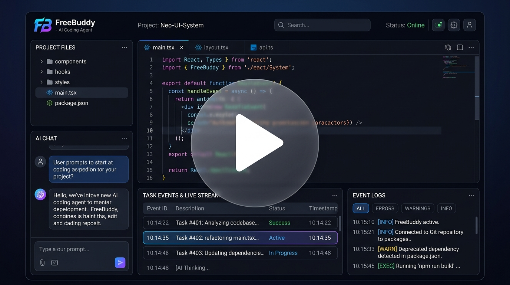

# FreeBuddy

[English](README.md) | [简体中文](README.zh-CN.md)

<p align="center">
  <a href="https://github.com/maojindao55/freebuddy/blob/main/LICENSE"></a>
  
  
  
</p>

**面向本地编码 Agent 的桌面工作台。**

<p align="center">
  <a href="https://www.bilibili.com/video/BV1zQTp6HERQ/" target="_blank">
    
  </a>
</p>


FreeBuddy 把 Codex、ClaudeCode、OpenCode、Cursor 这类本地编码 Agent 变成一个桌面应用里的“团队成员”。选择一个 Agent，指定工作目录，附上有用的上下文，然后像派发任务一样让它开始工作。你看到的不是黑盒聊天，而是一条清晰、可追踪、可复盘的结构化执行流。

它适合希望充分使用本地 AI 编码工具，但不想在多个终端、命令参数、日志文件和临时会话之间来回切换的开发者。

## 为什么需要 FreeBuddy

AI 编码工具真正好用的前提，是它能在你的真实代码目录里工作，能延续上下文，也能让你看见它正在做什么。FreeBuddy 把这套流程收进一个安静、专注的桌面界面：

- **一个工作台，管理多个 Agent**：在 Codex、ClaudeCode、OpenCode、Cursor 之间切换，不需要为每个 CLI 重新整理一套工作方式。
- **贴近本地项目上下文**：从真实工作目录开始，可以在对话里附加本地文件，让任务始终围绕当前代码库展开。
- **执行过程透明可见**：助手回复、工具调用、命令执行、文件改动、用量、stderr 和错误都会实时呈现为结构化事件。
- **会话可以延续**：同一个 `(Agent, 工作目录)` 的后续对话可以恢复已保存的工具会话，适合多轮迭代一个功能或问题。
- **本地优先存储**：任务历史、运行时检查、配置覆盖、会话和日志都保存在你的机器上。
- **内置 ACP 运行层**：FreeBuddy 使用 Agent Client Protocol 作为产品侧运行层，让界面关注 Agent 和任务本身，而不是各种协议和命令细节。

## 你可以用它做什么

- 在改动风险较大的功能前，让 Agent 先分析仓库结构和影响范围。
- 把 bug 描述、日志、截图或设计说明作为附件交给 Agent，让它带着上下文判断问题。
- 在同一个桌面界面里完成实现、调试、代码审查和解释类任务。
- 对比不同本地 Agent 处理同一个代码库时的思路和结果。
- 对需要多轮推进的功能，恢复之前的工具会话继续协作。
- 留下一份清楚的任务记录：谁执行了、在哪个工作区执行、过程中发生了什么。

## 基本使用流程

1. 打开 FreeBuddy。
2. 选择一个编码 Agent。
3. 选择工作目录，或者不设置目录来处理通用任务。
4. 输入提示词，按需附加本地文件，然后启动任务。
5. 查看实时的消息、命令、文件改动、用量和错误流。
6. 之后继续对话时，沿用同一个 Agent 和工作目录的上下文。

## 内置 Agent

| Agent | 命令 | 安装提示 |
| --- | --- | --- |
| Codex | `codex-acp` | `npm install -g @zed-industries/codex-acp` |
| ClaudeCode | `claude-agent-acp` | `npm install -g @agentclientprotocol/claude-agent-acp` |
| OpenCode | `opencode` | `npm install -g opencode-ai` |
| Cursor | `cursor-agent` | `curl https://cursor.com/install -fsS \| bash` |
| Kimi | `kimi` | `curl -fsSL https://code.kimi.com/kimi-code/install.sh \| bash` |
| Qoder | `qodercli` | `curl -fsSL https://qoder.com/install \| bash` |

打开 **Settings -> Coding Agents** 可以检查运行时是否已安装，执行推荐安装命令，自定义二进制路径，设置模型，传入额外参数，配置环境变量，或者选择 Agent 头像。

## 桌面端能力

FreeBuddy 选择 Electron，是因为编码 Agent 的工作流需要的不只是一个浏览器页面：

- 访问本地文件和工作目录
- 启动本地 Agent 进程
- 展示类似终端的执行流
- 持久化任务历史和 JSONL 日志
- 检查运行时并维护每个 Agent 的配置
- 处理权限确认和任务中断

浏览器预览适合做视觉调试，但只有桌面应用可以访问 CLI 桥接层。

## 安装

```sh
npm install
```

`postinstall` 会为 `better-sqlite3` 运行 `electron-rebuild`，确保原生绑定和当前 Electron 版本匹配。

## 运行桌面应用

```sh
npm run dev
```

## 构建

```sh
npm run build
npm run start
```

## 浏览器预览

```sh
npm run preview
```

浏览器预览无法访问 CLI 桥接层，只适合做界面视觉迭代。

## 数据存储

状态保存在 `<userData>/freebuddy/` 下：

- `freebuddy.db`：SQLite 数据库，保存执行器配置覆盖、任务、运行时、对话、消息和工具会话
- `cli-logs/<sessionId>.jsonl`：每个任务对应的 JSONL 日志

## 旧版 macOS 原生外壳

之前基于 AppKit + `WKWebView` 的实验仍保留在 `desktop/macos` 中，方便对照。当前主方向是 Electron，因为 FreeBuddy 需要类似 WorkBuddy 的桌面运行能力：文件系统、终端、本地 Agent 进程、插件和更完整的调试体验。
