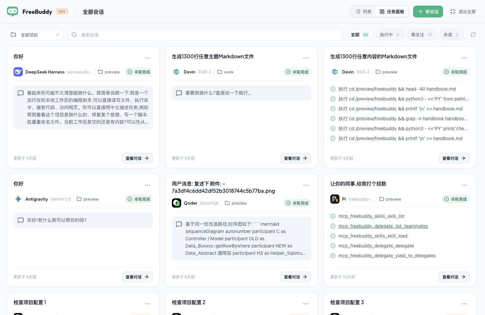
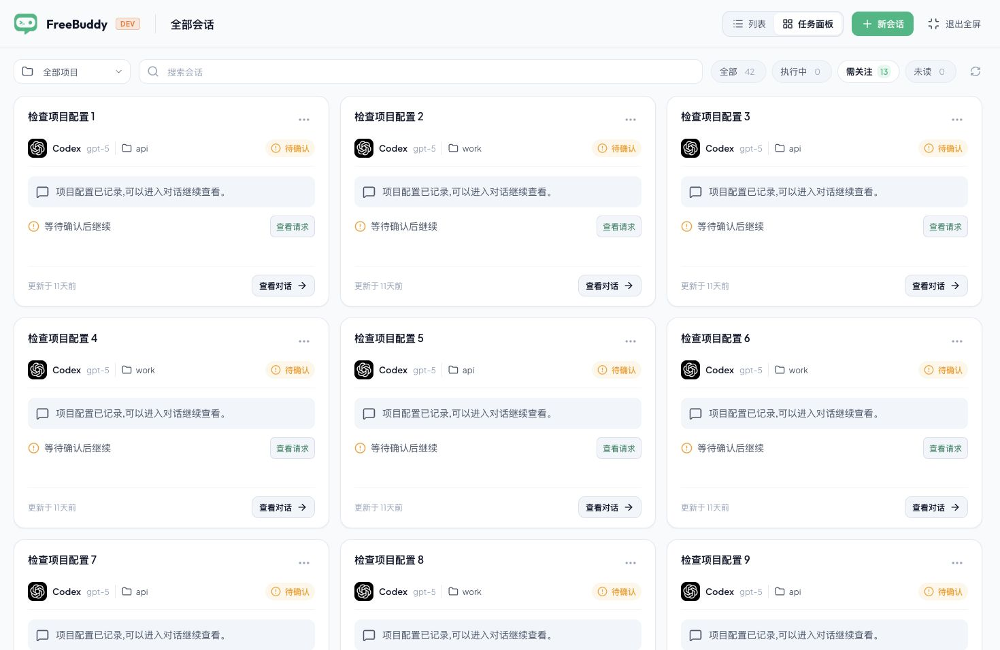
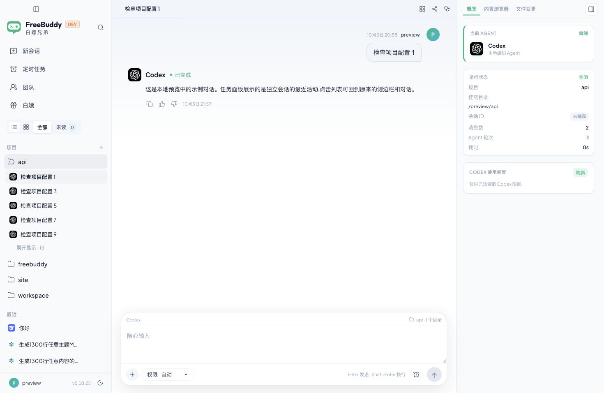

# 会话任务面板内容层级检查

日期：2026-10-05。范围：会话总览 → 需关注筛选 → 原对话详情。

用户目标是快速看懂哪些会话正在做什么、哪些需要处理。这次检查以用户新截图和本轮浏览器捕获为依据，不沿用上一轮演示内容的视觉结论。

用户截图显示 42 个会话，首屏包含长回复、六条命令、MCP 原名、Mermaid 和附件哈希标题。为了复现这些输入，本轮使用实际 App 组件及内存桥接，创建 42 个会话的内容压力场景；它与用户数据具有同类内容，不连接真实数据库，不发起真实审批或 Agent 执行。

## 1. 全屏总览 — 需要整理信息层级

原始用户证据已保存在 [clarity-user-before.png](clarity-user-before.png)。本轮浏览器截图为 1470 × 956 CSS px，复现同类内容和相同的 42 / 0 / 13 / 0 数量。

已有能力：项目、搜索、状态和未读筛选在顶部可见；卡片包含标题、Agent 和原对话入口。

- [P1] 原始执行命令和 MCP 工具名直接作为正文。重复 cwd 和代码参数占据一整行，任务含义被挤出首屏。应提取有证据的简短动作，保留原记录与导航关联。
- [P2] 回复最多五行且有整块灰底，纯问候与代码片段都抢占视线。应清理 Markdown / 代码，普通摘要保留两行，不生成额外模型总结，也不猜测任务成果。
- [P2] 长标题、状态换行和六条日志使卡片主区域的起点与高度不一。应统一单行标题与身份位置，正文最多三条活动；完成态使用低强调文字，正在执行和待处理才保留显著颜色。
- [P2] 同一行被最长的卡片拉高，短回复留下大块空白。应减小卡片最小高度、去掉聊天气泡和多余分隔线，将“查看对话”改为轻量入口。

截图层面的可访问性风险：辅助文字偏淡，长标题被截断后需要可读的完整提示。状态必须保留文字，不能只靠颜色；详细活动的键盘入口与原数据关联需在修改后验证。

## 2. 需关注筛选 — 路径可用，问题需要更突出

点击“需关注 13”后显示 13 张卡片，计数与筛选一致。每张卡片都有“查看请求”，但普通摘要、状态标签与待确认区域重复争夺注意力。建议将当前待处理原因保留为主要内容，使问题入口更容易发现。

限制：压力场景的待确认状态来自概览演示数据，没有真实权限队列；本轮没有批准或拒绝任何真实请求，截图不能证明真实审批流程的所有权限选项。

## 3. 查看请求 / 对话详情 — 原有阅读路径正常

点击第一张需关注卡片的“查看请求”进入正确的“检查项目配置 1”对话，恢复原侧栏与 ChatView，并提供“返回任务面板”入口。完整对话应继续留在此处，卡片只承担概览职责。

截图可证明正确导航和可见入口；不据此宣称完整屏幕阅读器或键盘可访问性合规。Codex 用量区域在演示桥接下显示暂不可用，与此次卡片层级问题无关。

## 修改后的验收要求

1. 长回复、命令全文、MCP 原名、代码块不会再次铺满卡片。
2. 完成与空闲状态保持可读，执行中、失败和待确认仍能一眼识别。
3. 卡片保留真实标题、模型、项目、状态与导航对象；不伪造完成结果。
4. 正文继续沿用 ChatView 的 14px / 22px 字体，窄屏无溢出。
5. 列表返回、请求 / Diff 入口、搜索筛选、未读与会话操作正常。

最终修改的比较和验证记录追加到项目根目录 `design-qa.md`。

## 修复后复核

1. **全屏总览：已改善。** P1 原始命令 / MCP 和 P2 长回复 / 源码、混合层级、卡片留白问题已修复。正文为两行摘要或最多三条友好动作，标题与身份位置统一，完成态不再使用绿色胶囊。见 [改后总览](clarity-after.jpg) 与 [完整比较](clarity-comparison-full.jpg)。
2. **需关注筛选：可用。** 13 张卡片与计数一致；当前原因和“查看请求”可见，返回面板后筛选保持。见 [改后需关注](clarity-attention-after.jpg)。
3. **原对话详情：可用。** 请求入口恢复正确 ChatView；精简动作仍可进入来源会话并展开全部六条命令，文件活动可打开原始 Diff，列表恢复最近选择的会话。见 [原始命令详情](clarity-detail-after.jpg)。

本轮 35 条定向测试、类型检查、renderer 构建及浏览器检查通过。无剩余 P0 / P1 / P2；真实审批处理和原生窗口动画的验证边界不变。完整记录见 [design-qa.md](../../../design-qa.md)。
