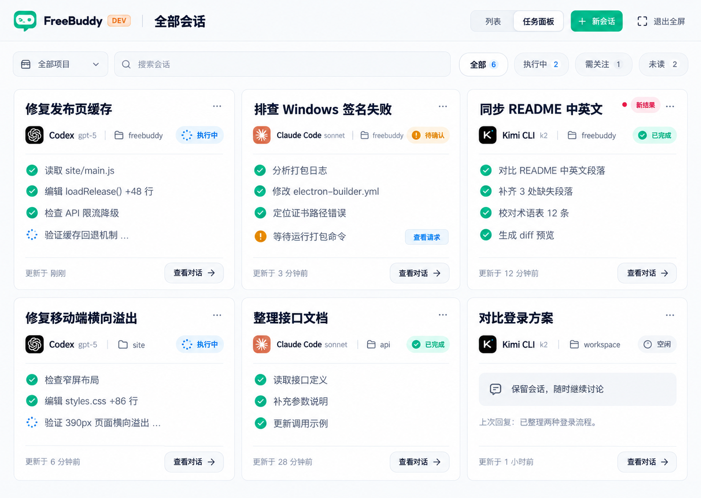

# FreeBuddy 会话列表「任务面板」方案

日期：2026-10-05。状态：已实施并通过验收。范围按用户最新说明修正。

## 目标与范围

为现有会话列表增加「列表 / 任务面板」两种展示方式。用户在任务面板中同时观察多个会话正在做什么，并可全屏查看，一目了然地找到正在执行和需要处理的任务。

**一张卡片对应一个会话。** 不按 Agent 类型或团队角色分列；同一个 Codex 的两段会话显示两张独立卡片。团队会话也是一张会话卡片，其内部成员活动可作为摘要，详细内容点击进入原会话。

首版直接覆盖当前用户可见的多个会话，包含跨项目总览和项目筛选。切换展示方式使用同一批会话、标题、项目、未读和操作权限，不创建新的任务实体或改变并发策略。

## 推荐效果

这是单一推荐方案的全屏示意。通过 ImageGen 生成，输入为用户参考图和仓库现有 FreeBuddy 界面截图。卡片文案、模型和状态为演示数据；实际产品只呈现可验证的活动和结果。[生成提示词](../../artifacts/product-design/multi-agent-activity-view/conversation-task-panel-prompt.md)已一并保存。

## 入口与浏览路径

1. 在现有会话列表顶部「全部 / 未读」附近增加列表与任务面板的切换入口，使用图标加提示，避免挤压 272px 侧栏。
2. 点击「任务面板」后，主工作区显示会话卡片网格。普通模式保留侧栏导航，主区域使用「全部会话」标题，右侧详情区收起。
3. 面板顶部提供「列表 / 任务面板」切换、项目筛选、搜索与全屏入口。切回列表恢复现有侧栏列表和最近浏览的会话；无有效会话时回到新会话首页。
4. 点击任务标题或「查看对话」进入现有 ChatView，并保留「返回任务面板」入口；返回时恢复筛选、滚动位置和展示偏好。进入面板保留上次 activeId，不调用 setActive(undefined)；用户真正打开会话时才选择会话并切回 chat。
5. 全屏模式只保留面板工具栏、退出全屏入口和卡片，收起侧栏与右侧详情。退出恢复进入前布局，正在执行的任务持续运行。

面板读取所有用户可见的未归档会话，不能沿用侧栏的最近 8 条、每项目预览 5 条和项目显示 6 条等展示截断。大量会话使用分页或窗口化呈现。

## 卡片结构

| 层级 | 内容 | 设计目的 |
| --- | --- | --- |
| 首行 | 单行会话标题、状态、未读点与更多操作；完整标题保留提示 | 优先回答“这是哪件事，是否需要介入” |
| 身份行 | Agent 图标、名称、实际模型、项目 | 区分执行者和上下文 |
| 状态 | 执行中 / 待确认 / 失败保留颜色与图标；本轮完成 / 空闲使用轻量文字 | 快速判断是否需要介入 |
| 主体 | 最多三条简短活动，或两行纯文本回复摘要；完成后优先回复 | 看懂正在做什么或最后说了什么 |
| 问题区域 | 当前待确认请求或失败原因，提供处理入口 | 不打开会话也能发现问题 |
| 底部 | 更新时间、轻量“查看对话”入口 | 判断信息新鲜度并进入详情 |

聊天型会话未必有工具活动，此时显示最后回复摘要；没有活动不能渲染成故障或假造“读取/编辑”条目。默认不显示完整对话和长终端输出。

按用户最新的内容层级反馈，已去掉灰色回复气泡与卡内分隔线。命令和已知工具显示有证据的短动作，保留原本可读的自然描述；文件路径只缩短展示，导航仍使用原始路径。完成活动按短标签去重，运行、待执行和失败调用保留各自来源。代码与图表留在对话详情，面板不额外调用模型生成摘要。

点击卡片中的文件活动可进入对应会话的现有 Diff；缺少可定位的文件证据时只回到原消息。卡片中的审批入口定位到该会话现有请求流程，保留原来的具体权限选项。

重命名、归档和删除放进卡片更多菜单，复用现有规则。不要把删除当成卡片的显著主操作，也不要提供未获用户操作的“全部停止”。

## 布局与全屏

- 沿用 FreeBuddy 的背景、字体、品牌绿、警告色和主题变量；圆角 16px，卡片间距 16px，页面留白 20px，卡片留白 18–20px；按用户反馈与 ChatView 对齐，正文使用同一字体与 14px / 22px 行高，卡片标题 15px / 600，控件 12–13px。
- 卡片最小宽度约 300px。普通窗口依据实际内容区自动显示 1–3 列，全屏或大屏可扩展到 4 列。
- 卡片最小高度 244px，同一行对齐，默认只展示最多三条活动或两行摘要；面板整体纵向滚动，完整历史进入原对话查看。
- 排序默认按最近活动，新进入面板时可将需要处理和执行中的会话优先。当前浏览期间保持卡片位置稳定，更新日志不持续重排卡片。
- 顶部筛选建议为「全部 / 执行中 / 需关注 / 未读」，再加项目下拉和标题搜索。统计数量取完整筛选集合，不能只统计当前已渲染页。
- 未读、执行状态是不同维度：本轮完成也可能未读；正在执行也可能有新消息。仅浏览面板不自动标记会话已读。

“全屏”包含两层：任务面板铺满应用内容区，并支持进入操作系统全屏。建议按钮统一执行进入全屏展示与窗口全屏操作；记录进入前的侧栏、详情区和原生全屏状态，退出时恢复。应用原本已经系统全屏时，退出面板全屏不能强制把应用退出系统全屏。

现有 Electron 主窗口已有原生全屏事件与 Escape 退出处理，但没有核实到现成的 renderer 全屏设置接口。实施时应增加最小的受控窗口 IPC，或连接现有菜单的能力。统一处理 Escape：先关闭菜单/对话框，随后退出面板全屏；避免主进程与 renderer 同时切换导致状态失配。Web 预览使用可用的 Fullscreen API，无法进入原生全屏时仍保留应用内铺满模式。

## 状态语义

状态反映该会话当前或最近一轮任务，不等同于某个工具调用或未读标记。

| 状态 | 判断原则 |
| --- | --- |
| 执行中 | 当前 CLI session 或 Workflow / Delegation run 实际处于运行状态 |
| 待确认 | 存在尚未解决的权限、认证或委派写入审批；说明具体原因 |
| 等待 / 排队 | 当前任务实际等待其他任务结果或尚未获得执行槽位 |
| 已暂停 / 已停止 | 来自真实任务运行控制结果 |
| 本轮完成 | 当前/最近一轮有明确成功结束依据，会话仍可继续 |
| 失败 / 超时 | 当前/最近一轮有明确失败、超时结果 |
| 空闲 | 没有执行中的任务，也没有可表示为刚完成的任务结果，例如普通讨论 |
| 加载中 / 状态未知 | 尚未取得可靠摘要，或状态来源暂不可用 |

有待确认事项时应优先显示问题。失败过后重新运行，应显示新一轮的运行状态；不能让历史失败一直覆盖当前执行中。缺少后台缓存时，不能把任务自动归为完成或空闲。

## 现有代码与需要补齐的部分

| 能力 | 现有位置 | 复用方式与限制 |
| --- | --- | --- |
| 会话列表入口 | src/components/CLI/ConversationList.tsx | 顶部已有全部/未读，列表行已有头像、标题、运行与未读指示 |
| 工作区布局 | src/App.tsx | 使用 workspaceView 切换页面；可增加 conversationBoard 分支，控制面板与详情区的显示 |
| 页面枚举 | src/components/CLI/SidebarNavigation.tsx | WorkspaceView 增加面板类型，保留原有导航行为 |
| 会话标题和操作 | src/components/CLI/conversationTitle.tsx、src/store/conversationStore.ts | 复用显示标题、重命名、选择、归档、删除，不在面板复制一套规则 |
| 项目分组 | src/components/CLI/conversationProjectGrouping.ts | 复用 projectId、cwd 和未归属项目逻辑；面板不继承侧栏展示条数限制 |
| CLI 即时状态 | src/store/conversationStore.ts | live 对当前客户端正在跟踪的任务可用，不能当作所有后台会话的完整状态来源 |
| Workflow 运行概览 | src/store/workflowStore.ts | activeRuns 可作为一部分状态来源，不足以表达所有历史结果和 Delegation |
| 消息变化 | src/App.tsx、src/store/conversationStore.ts | 存在事件订阅，但后台未选择的会话未必加载消息，旧缓存可能不新鲜 |
| 活动内容 | packages/protocol/src/cli.ts、src/components/CLI/StreamItem.tsx | 从结构化工具活动和既有动作格式化逻辑提取短摘要 |
| 未读与结果通知 | src/store/conversationUnread.ts | 复用未读标记；消息/成功/失败通知不能单独充当永久运行状态 |
| 权限请求 | src/store/permissionStore.ts、src/store/authenticationStore.ts | 依据 conversationId 定位；Delegation 写入审批仍走对应 run 的流程 |
| 全屏窗口 | electron/main.ts | 已有 enter/leave-full-screen、window:chrome 与 Escape 处理；面板展示状态需与其协调 |

首版最重要的数据补齐是：**面向多个会话的轻量概览读取与更新**。仅把 ConversationRow 换成卡片，会缺少可靠的后台状态和活动内容。

当前 App 的通用消息变化处理，对非 activeId 会话主要标记未读和刷新列表，随后返回；不会全面刷新这些会话的消息。Workflow 订阅也按选择/缓存及运行状态管理。因此任务面板不能只遍历 messages 缓存，更不能为几十张卡片同时加载全部历史。

另外，现有未读规则主要通过 activeId 判断会话是否正在被查看。进入面板时即使保留最后一个 activeId，该会话实际上已经不在 ChatView 中；需要把“对话正文是否正在可见地阅读”纳入已读/未读判断。启动时恢复面板也不能因为恢复 activeId 就自动清除其未读。

## 实现建议

建议新增以下职责，组件名称为拟定：

- ConversationTaskPanel：筛选、搜索、项目上下文、响应式卡片集合、全屏控制。
- ConversationTaskCard：一个会话的标题、身份、状态、当前动作、最近活动和详情入口。
- conversationOverviewStore：按 conversationId 缓存轻量摘要与更新时间，不持有整段历史。
- conversationPanelUiStore：保存列表/面板偏好、筛选、全屏展示、返回位置；展示切换不改变执行状态。
- selectConversationOverview：合并真实运行、审批与最新消息证据，状态优先级独立于未读。
- activityFormatting：共享现有动作标签规则，合并同一工具调用的更新。

建议后端提供按可见会话分页或按 ID 批量查询的轻量摘要接口。拟定概览字段：

- conversationId、当前任务/session/run 的关联 ID；
- status、最后状态更新时间、Agent/实际模型、待处理事项数量；
- 当前动作、最近 4–6 条活动，或最后回复摘要；
- 每条活动的 sourceMessageId 和可选 toolCallId；
- 是否有更多活动，以及用于增量更新的 revision/updatedAt。

摘要查询必须沿用现有会话可见性/owner 访问检查。前端筛选不是权限边界，不能先返回所有用户数据再在前端过滤。管理员可见其他用户会话时，卡片沿用列表里的 @owner 标识，避免混淆任务归属。

优先复用已有任务、run、消息和审批记录，必要时为摘要增加缓存或投影，避免每次请求对所有历史 JSON 全量扫描。增量通知携带会话 ID 或摘要版本，面板只刷新变化的可见卡片；进入面板初次批量加载，离开后取消面板自己的刷新。事件有遗漏时使用一个低频统一校准，不给每张卡片各开一个无限轮询。

活动显示规则：同一工具调用合并状态更新；过滤 usage、thinking 和大段 stdout；不调用额外模型逐条总结。当前工具活动没有统一时间戳，因此展示已知消息顺序和摘要更新时间，不编造每一步耗时或进度百分比。缺少可靠证据时显示最后回复和状态，而不是填充参考图中的示例日志。

## 首版交付与验收

首版包括：列表/任务面板切换、所有可见会话的卡片、项目/状态/未读筛选、搜索、可靠后台摘要、全屏进入退出、返回原会话、必要的请求/Diff 跳转。

以下体验应同时成立：

1. 两个 Codex 会话是两张卡片；一个团队会话仍是一张卡片。
2. 用户不点开任何会话，也能观察不同项目的后台任务变化。
3. 同一任务在列表和面板中的标题、未读、运行状态一致。
4. 新任务、重命名、归档、删除和完成通知能更新正确卡片。
5. 打开面板与恢复面板不清除未读；进入会话正文才按既有阅读行为处理。
6. 点击卡片进入正确会话，返回后保留面板筛选与位置。
7. 全屏可通过明确按钮和 Escape 退出，恢复原布局；不会停止任务。
8. 有大量会话时不批量拉取全部消息，活动更新不导致整页重排和明显卡顿。
9. 深色模式、长标题、无工具活动、加载失败、历史失败后重试都正确展示。
10. 不出现普通用户跨账号数据或遗漏可见会话的问题。

实施阶段已验证跨会话状态聚合、摘要增量更新、未读语义、全屏恢复与布局表现。最终实现、迭代比较、交互证据和验证边界见 [视觉验收记录](../../design-qa.md)。类型检查、renderer 构建和完整回归通过，共 1,674 条测试通过。
